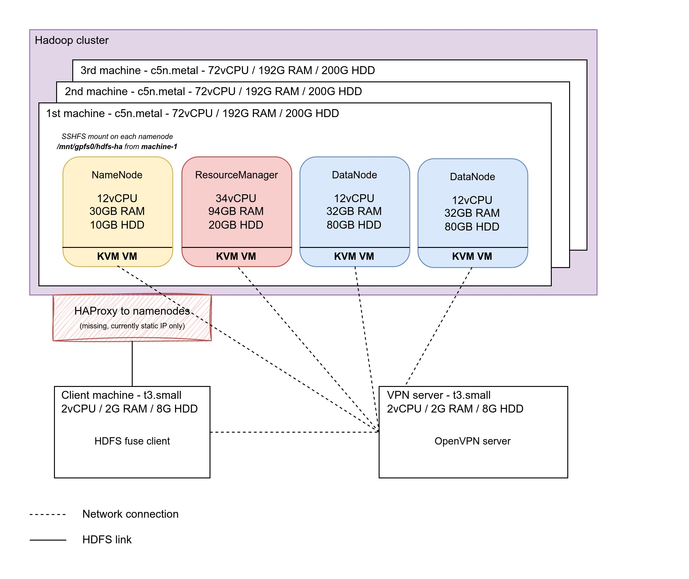
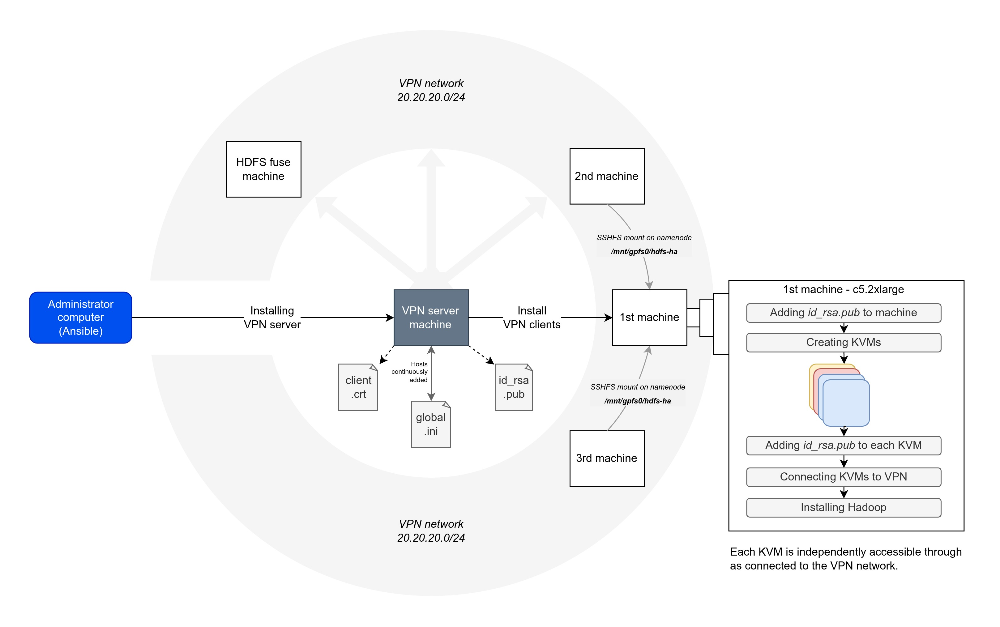

# aws-terraform-ansible-kvm-hadoop

A sample project to install Hadoop on KVM with Ansible on an AWS machine instanciated by Terraform.

This repo is for training purposes. If you use Cloud providers, only use KVM if you absolutely NEEDS TO. It asks for a more costly infrastructures, time-consuming instanciations, adds a layer of complexity already managed by Cloud providers (network, machines configuration) and as such is a burden to maintain. This architecture is only useful if you have big machines that must include strictly partitioned VMs.

In this architecture, we need to setup a VPN server to connect all KVM guests so they can communicate. This will allow us to make Hadoop nodes communicate through the VPN network.

## KVM in the Cloud

Basically, you can't do it on classic AWS [unless you have a dedicated instance](https://aws.amazon.com/blogs/aws/new-amazon-ec2-bare-metal-instances-with-direct-access-to-hardware). You are recommended to do it on [AWS Dedicated EC2](https://aws.amazon.com/ec2/pricing/dedicated-instances).

As I had to ask a limit raise for my account to be able to instanciate this kind of instance, I used [Scaleway Elastic Metal](https://www.scaleway.com/en/elastic-metal/) in the meantime.

## 1. Instanciate the infrastructure



<details open>
<summary>👉 Using AWS (price: 822.71$/month)</summary>

_To be written..._

</details>

<details open>
<summary>👉 Using Scaleway (price: 303.37$/month)</summary>

1. Go to your Scaleway account > [Credentials](https://console.scaleway.com/project/credentials) and create a new API key `terraform-ansible-kvm-hadoop`

2. Run the following `export` commands replacing values by yours

    ```bash
    export TF_VAR_SCW_PROJECT_ID="my-project-id"
    export TF_VAR_SCW_ACCESS_KEY="my-access-key"
    export TF_VAR_SCW_SECRET_KEY="my-secret-key"
    ```

3. Make sure there's no error by running init and plan commands

    ```bash
    cd ./plans
    terraform init
    terraform plan
    ```

4. Execute the plan

    ```bash
    terraform apply
    ```

5. Edit values of our Ansible inventory file from Terraform output values

    ```bash
    # Install JSON parser
    sudo apt install -y jq
    # Retrieve and set appropriate values
    terraform output -json > terraform_values.json
    cd ..
    bash terraform_to_ansible_values.sh
    ```

</details>

## 2. Setup the infrastructure and install services



1. Install the OpenVPN server

    ```bash
    ANSIBLE_CONFIG=$(pwd)/ansible.cfg ansible-playbook -i inventories/machines.ini ./playbooks/install.yml --extra-vars @./vars/all.yml -t vpn-server
    ```

2. Install KVM on each host and create guests

    ```bash
    ansible-galaxy collection install community.libvirt
    ansible-playbook -i inventories/machines.ini ./playbooks/install.yml --extra-vars @./vars/all.yml -t kvm-install
    ```

3. Connect all machines to communicate with each other (OpenVPN clients)

    Connect and retrieve IP of each KVM guest.

    ```bash
    ssh-add -D
    ansible-playbook -i inventories/machines.ini ./playbooks/install.yml --extra-vars @./vars/all.yml -t vpn-client
    ```

4. Install Hadoop cluster

    ```bash
    ansible-playbook -i inventories/machines.ini ./playbooks/install.yml --extra-vars @./vars/all.yml -t hadoop-install
    ```

5. Install HDFS fuse client

    ```bash
    ansible-playbook -i inventories/machines.ini ./playbooks/install.yml --extra-vars @./vars/all.yml -t hdfs-fuse-install
    ```

## Inspirations

- OpenVPN : [robertdebock/ansible-role-openvpn](https://github.com/robertdebock/ansible-role-openvpn)
- Hadoop : [andiveloper/ansible-hadoop](https://github.com/andiveloper/ansible-hadoop)
- KVM : [noahbailey/ansible-qemu-kvm](https://github.com/noahbailey/ansible-qemu-kvm)
