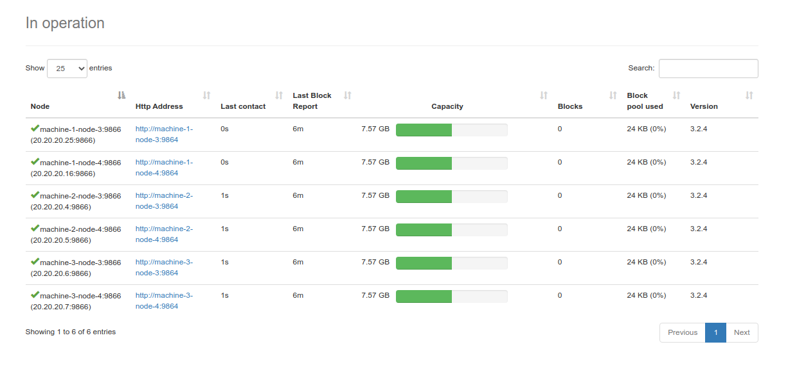
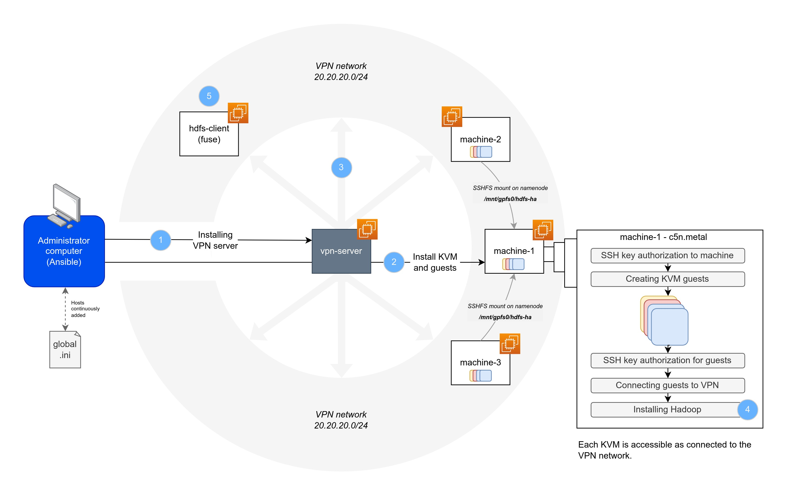

# aws-terraform-ansible-kvm-hadoop

A sample project to install Hadoop on KVM with Ansible, on AWS machines instantiated by Terraform.

Here is an example of HDFS storage cluster running with this project.




## A note about KVM in the Cloud

Basically, you can't work with KVM on a classic AWS EC2 instance [unless you have a baremetal one](https://aws.amazon.com/blogs/aws/new-amazon-ec2-bare-metal-instances-with-direct-access-to-hardware). You must choose a `*.metal` instance type (:moneybag:).

This repo is for educational purposes. If you use Cloud providers, only use KVM if you absolutely NEEDS TO. It asks for a more costly infrastructure, time-consuming instanciations, adds a layer of complexity already managed by Cloud providers (network, machine configuration) and as such is a burden to maintain. This architecture is only useful if you have big machines that must include strictly partitioned VMs.

As [Scaleway Elastic Metal](https://www.scaleway.com/en/elastic-metal/) machines are way less expensive than AWS, you will find Terraform plans and instructions for both AWS and Scaleway.

## 1. Instantiate the infrastructure


In this architecture, we will setup a VPN server to get KVM guests to communicate. After setting up and connecting Hadoop nodes through the VPN network, a client will try to [mount an HDFS space as a FUSE](https://github.com/flavienbwk/native-hdfs-fuse) to be used as a file system.

The ResourceManager described here will get the roles of ResourceManager, NodeManager and MapReduce Job History server.

<details close>
<summary>👉 Using AWS (price: 8545.09$/month)</summary>

:warning: :moneybag: Please be very careful running the Terraform plans as prices for baremetal instances are **very high**. The indicated cost is about the least expensive instance found in the North Virginia region.

1. [Create AWS credentials](https://us-east-1.console.aws.amazon.com/iamv2/home?region=us-east-1#/security_credentials) and set them inside the `~/.aws/credentials` file :

    ```bash
    # ~/.aws/credentials
    [default]
    aws_access_key_id = my-access-key
    aws_secret_access_key = my-secret-key
    ```

2. [Import your public key](https://us-east-1.console.aws.amazon.com/ec2/v2/home?region=us-east-1#ImportKeyPair:) with name `main` in EC2's Key Pairs menu

3. Make sure there's no error by running `init` and `plan` commands

    Make sure to have an SSH key which description is `main` [in your Scaleway account](https://console.scaleway.com/project/credentials).

    ```bash
    terraform -chdir=./plans/aws init
    terraform -chdir=./plans/aws plan
    ```

4. Execute the plan

    This command will generate our `global.ini` inventory file :

    ```bash
    terraform -chdir=./plans/aws apply
    ```

    > To terminate instances and avoid unintended spendings, use `terraform destroy`

</details>

<details close>
<summary>👉 Using Scaleway (price: 303.37$/month)</summary>

1. Go to your Scaleway account > IAM > [API Keys](https://console.scaleway.com/iam/api-keys) and create a new API key `terraform-ansible-kvm-hadoop`

2. Run the following `export` commands replacing values by yours

    ```bash
    export TF_VAR_SCW_PROJECT_ID="my-project-id" # Find this in console.scaleway.com/project/settings
    export TF_VAR_SCW_ACCESS_KEY="my-access-key"
    export TF_VAR_SCW_SECRET_KEY="my-secret-key"
    ```

    > Tip : append these variables to your `~/.bashrc` file

3. Make sure there's no error by running `init` and `plan` commands

    Make sure to have an SSH key which description is `main` [in your Scaleway account](https://console.scaleway.com/project/credentials).

    ```bash
    terraform -chdir=./plans/scaleway init
    terraform -chdir=./plans/scaleway plan
    ```

4. Execute the plan

    This command will generate our `global.ini` inventory file :

    ```bash
    terraform -chdir=./plans/scaleway apply
    ```

    > To terminate instances and avoid unintended spendings, use `terraform destroy`

</details>

## 2. Setup the infrastructure and install services



1. Install the OpenVPN server

    ```bash
    ansible-playbook -i inventories/global.ini ./playbooks/install.yml --extra-vars @./vars/all.yml -t vpn-server
    ```

2. Install KVM on each host and create guests

    ```bash
    ansible-galaxy collection install community.libvirt
    ansible-playbook -i inventories/global.ini ./playbooks/install.yml --extra-vars @./vars/all.yml -t kvm-install
    ```

3. Connect all machines to communicate with each other (OpenVPN clients)

    Connect and retrieve IP of each KVM guest :

    ```bash
    eval `ssh-agent` && ssh-add -D
    ansible-playbook -i inventories/global.ini ./playbooks/install.yml --extra-vars @./vars/all.yml -t vpn-client
    ```

4. Install Hadoop cluster

    ```bash
    ansible-playbook -i inventories/global.ini ./playbooks/install.yml --extra-vars @./vars/all.yml -t hadoop
    ```

5. Install HDFS FUSE client

    ```bash
    ansible-playbook -i inventories/global.ini ./playbooks/install.yml --extra-vars @./vars/all.yml -t hdfs-fuse-clients
    ```

## Inspirations

Great repos that helped build this one :

- OpenVPN : [robertdebock/ansible-role-openvpn](https://github.com/robertdebock/ansible-role-openvpn)
- Hadoop : [andiveloper/ansible-hadoop](https://github.com/andiveloper/ansible-hadoop)
- KVM : [noahbailey/ansible-qemu-kvm](https://github.com/noahbailey/ansible-qemu-kvm)
